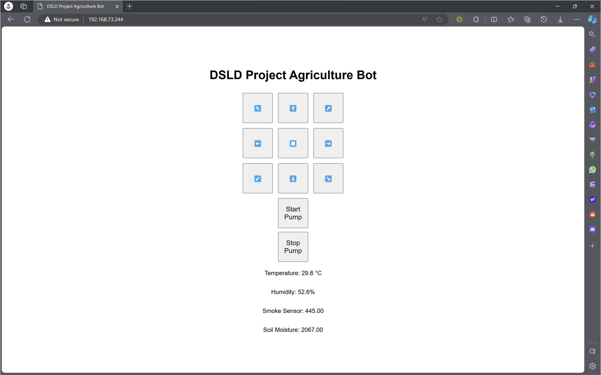

# 🌾 Agri Bot: Navigating the Landscape of Modern Agriculture

## 1. Project Idea 💡

The development aim of this device is to automate agricultural operations. Today, farmers pay a lot of money for machines that help them decrease labor and increase income from crops, but efficiency and profit are less. Hence, automation is the ideal solution to decrease all the failings by developing machines that perform one operation and automating to increase income on a large scale.

The development of a multifunctional agricultural robot geared towards ploughing, seeding, fertilizing, and irrigating signifies a substantial leap in farming technology. This project is a pivotal step towards minimizing operational costs while significantly reducing the time invested in these crucial agricultural tasks.

Efficiency and time management are critical aspects addressed by this project. Automating tasks that conventionally demand considerable manual labor translates to streamlined operations, reducing the time required for each activity. Furthermore, the integration of automation ensures that these tasks

## 2. Materials Used 🛠️

1. ESP32.
2. Smoke Detector (MQ-135).
3. Temperature and Humidity Sensor (DHT-11).
4. Soil Moisture Sensor.
5. Motor Driver L298N.
6. Development Board.
7. Wheels (4 Nos).
8. Jumper Wires.

## 3. Web Interface 🖥️

This code integrates with a web interface for remote control and monitoring of the bot.

()
